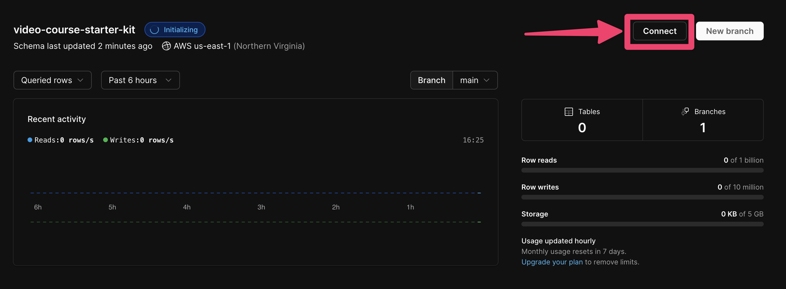
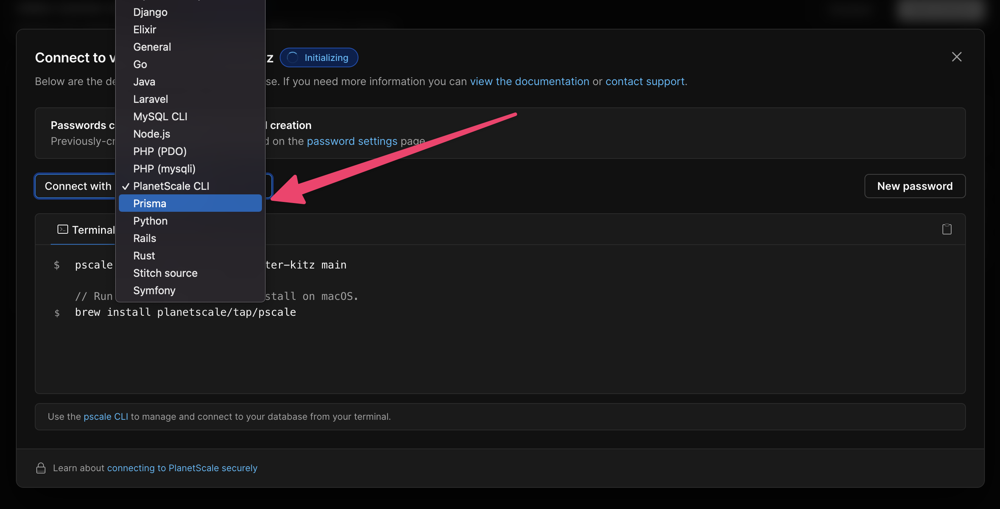
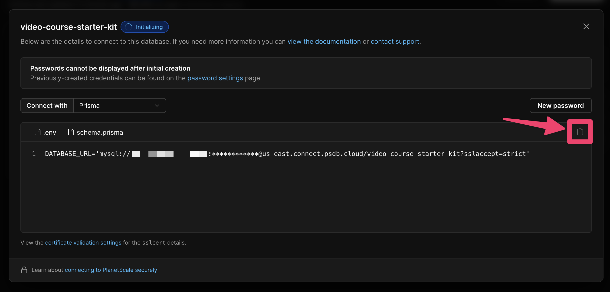
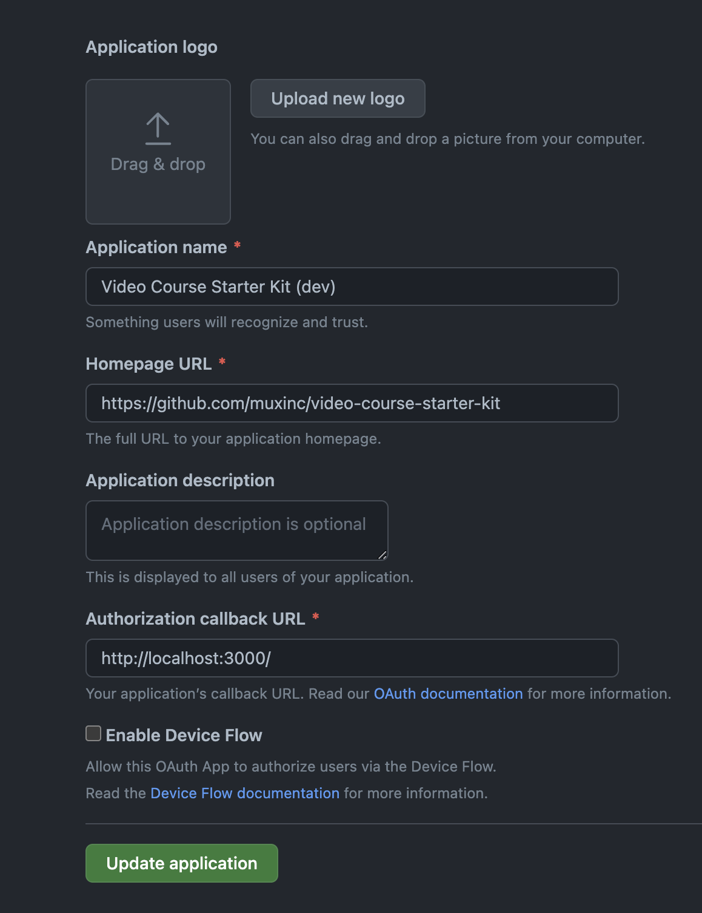

Este proyecto demuestra cómo puede usar Next.js y Mux para construir su propia plataforma de curso de video. Es posible que utilice este repositorio como punto de partida para construir su propia plataforma de curso de video con restricciones de membresía. Sientase libre de navegar el código fuente para ver cómo puede usar las APIs de video de Mux para subir, codificar y reproducir videos en su aplicación Next.js. Puede probar nuestra versión alojada de la aplicación en https://video-course-starter-kit.mux.dev

Detalles de la pila
Usamos herramientas modernas para construir este proyecto de ejemplo, incluyendo:

Escrito en TypeScript
Tailwind para el estilo CSS
Planetscale para la persistencia de datos
Prisma para ORM
NextAuth para la autenticación a través de GitHub
Mux para el streaming de video y la generación de miniaturas
Mux Player para la reproducción de video
Mux Uploader para la subida de video
Despliegue su propio
Regístrese para una cuenta de Mux
Mux codificará y servirá todos los videos dentro del curso de video. Para comenzar con $20 de crédito gratis, regístrese para una cuenta de Mux

Regístrese para una cuenta de Planetscale
Planetscale es una plataforma de base de datos sin servidor compatible con MySQL. Registrarse en Planetscale es gratis, puede registrar su cuenta aquí si aún no tiene una.

Instale este repositorio
Ejecute los siguientes tres comandos para clonar este repositorio e instalar sus dependencias:

Copy code
git clone https://github.com/muxinc/video-course-starter-kit.git
cd video-course-starter-kit
yarn
Crear un archivo .env.local
Este proyecto utiliza varios secretos para acceder a las diferentes cuentas utilizadas en todo el código. Puede configurar estos valores localmente copiando el archivo .env.local.example a un nuevo archivo llamado .env.local y completando los valores a medida que los reciba en los pasos a continuación. También no olvide agregar los valores a las variables de entorno del proyecto en producción en Vercel.

Configuración de la cuenta de Mux
Para autenticar esta aplicación con su cuenta de Mux, cree un nuevo token de acceso dentro del panel de Mux y copie el ID y el secreto del token de acceso en su archivo .env.local y en las variables de entorno de Vercel.

Configuración de la base de datos
Primero, asegúrese de tener mysql-client instalado localmente para poder aprovechar al máximo la herramienta pscale CLI. En MacOS con Homebrew instalado, puede ejecutar el siguiente comando en su terminal:

Copy code
brew install mysql-client
A continuación, instale la CLI de Planetscale. De nuevo, en MacOS, este comando hará la magia:

Copy code
brew install planetscale/tap/pscale
A continuación, autorice la CLI de Planetscale con su cuenta recién creada ejecutando:

Copy code
pscale auth
Cree una nueva base de datos en su cuenta de Planetscale llamada video-course-starter-kit

Copy code
pscale database create video-course-starter-kit
Siga el enlace que se le proporciona después de ejecutar este comando para obtener la cadena de conexión de su base de datos.

Copie el valor resultante de la url de base de datos autenticada en su archivo .env.local y en las variables de entorno de Vercel. Conectaremos a esta base de datos localmente abriendo una conexión a ella.

En resumen, este proyecto es un kit de inicio para construir una plataforma de cursos de video con Next.js y Mux. Se utilizaron herramientas modernas como TypeScript, Tailwind, Planetscale, Prisma, NextAuth, Mux, Mux Player y Mux Uploader. Para implementar su propia versión, se deben registrar cuentas en Mux y Planetscale, clonar el repositorio, crear un archivo .env.local y configurar las cuentas de Mux y la base de datos en Planetscale. También es necesario tener instalado mysql-client y la CLI de Planetscale.

# Video Course Starter Kit

This project demonstrates how you can use Next.js and Mux to build your own video course platform. You might use this repo as a starting point for building your own membership-gated video course platform. 

Feel free to browse the source code to see how you can use Mux's video APIs to upload, encode, and playback videos in your Next.js app.

Try out our hosted version of the application at [https://video-course-starter-kit.mux.dev](https://video-course-starter-kit.mux.dev)

## Stack details

We used modern tooling to build this example project, including:

- Written in [TypeScript](https://www.typescriptlang.org/)
- [Tailwind](https://tailwindcss.com/) for CSS styling
- [Planetscale](https://planetscale.com/) for data persistence
- [Prisma](https://www.prisma.io/) for ORM
- [NextAuth](https://next-auth.js.org/) for authentication via GitHub
- [Mux](https://mux.com) for video streaming and thumbnail generation
- [Mux Player](https://docs.mux.com/guides/video/mux-player) for video playback
- [Mux Uploader](https://github.com/muxinc/elements/tree/main/packages/mux-uploader-react) for video uploading

## Deploy your own
### Register for a Mux account

Mux will encode and serve all of the videos within the video course. To get started with a complimentary $20 in credits, [sign up for a Mux account](https://dashboard.mux.com/signup)

### Register for a Planetscale account
Planetscale is a MySQL-compatible serverless database platform. Signing up for Planetscale is free – you can [register your account here](https://auth.planetscale.com/sign-up) if you don't already have one.

### Install this repo
Run the follow three commands to clone this repo and install its dependencies:
```
git clone https://github.com/muxinc/video-course-starter-kit.git
cd video-course-starter-kit
yarn
```

### Create a `.env.local` file

This project uses several secrets to access the different accounts used throughout the codebase. You can configure these values locally by copying the `.env.local.example` file to a new file called `.env.local` and filling out the values as you receive them in the steps below.

Also, don't forget to add the values to the project's environment variables in production on Vercel.

### Mux account setup

To authenticate this application with your Mux account, [create a new access token](https://dashboard.mux.com/settings/access-tokens) within the Mux dashboard and copy the access token ID and secret into your `.env.local` file and into your Vercel environment variables.

### Database Setup

First, make sure you have `mysql-client` installed locally so you can take full advantage of the `pscale` CLI tool down the road. On MacOS with Homebrew installed, you can run the following command in your terminal:

```
brew install mysql-client
```

Next, install the [Planetscale CLI](https://github.com/planetscale/cli). Again, on MacOS, this command will do the trick:

```
brew install planetscale/tap/pscale
```

Next, authorize the Planetscale CLI with your newly created account by running:

```
pscale auth
```

Create a new database in your Planetscale account called `video-course-starter-kit`
```
pscale database create video-course-starter-kit
```
Follow the link provided to you as a result of running this command to get the connection string for your database.





Copy the resulting authenticated database url value into your `.env.local` file and into your Vercel environment variables.

We'll connect to this database locally by opening a connection to it on a local port. Here's how you can connect to the Planetscale database `video-course-starter-kit` on port 3309:

```
pscale connect video-course-starter-kit main --port 3309
```

## Modifying the database schema

If you'd like to make any changes to the database schema, you can do so by following these steps:

```
pscale branch create video-course-starter-kit my-new-branch

# after a few moments, close and reopen db proxy to the new branch
pscale connect video-course-starter-kit my-new-branch --port 3309

# change your schema in the prisma/schema.prisma file... then,
npx prisma generate
npx prisma db push

# when ready, make a deploy request
pscale deploy-request create video-course-starter-kit my-new-branch

# shipit
pscale deploy-request deploy video-course-starter-kit 1
```

## Inspecting the database
Prisma provides a nice interface to be able to load up your database contents and see the data that is powering your application. When you've connected to your Planetscale database, you can load up the Prisma GUI with the following command:

```
npx prisma studio
```

## Handling webhooks

Mux uses webhooks to communicate the status of your uploaded video assets back to your application. To handle these webhooks locally, you'll first need to install [ngrok](https://ngrok.com/download).

```shell
brew install ngrok/ngrok/ngrok
ngrok config add-authtoken <YOUR_NGROK_TOKEN>
ngrok http 3000
```

Now, we need to make Mux aware of your ngrok URL. Visit [https://dashboard.mux.com/settings/webhooks](https://dashboard.mux.com/settings/webhooks) and add the tunnel URL listed in your terminal as a URL that Mux should notify with new events.

> Make sure to append `/api/webhooks/mux` to the end of your tunnel URL.

Then, copy the Webhook signing secret value and paste it into your `.env.local` file under `MUX_WEBHOOK_SECRET`

### Run the development server

Starting up the dev server is a simple one line command:

```
yarn dev
```

### GitHub OAuth setup

End users of this video course application can authenticate with their GitHub account. As a prerequisite, you'll need to create an OAuth App on GitHub that associates a user's access to your application with your GitHub account.

To create your OAuth app, follow these steps:

1. Go to [https://github.com/settings/developers](https://github.com/settings/developers)

2. Click "OAuth Apps" and create an Oauth application to use in Development:



| Application name               | Homepage URL                                       | Authorization callback URL |
|--------------------------------|----------------------------------------------------|----------------------------|
| Video Course Starter Kit (dev) | https://github.com/muxinc/video-course-starter-kit | http://localhost:3000/     |

3. Copy the `GITHUB_ID` and `GITHUB_SECRET` and paste them into your environment variables on Vercel and in your `.env.local` file.

> Note: when you deploy a production copy of this application, you'll need to create another GitHub OAuth app which uses your production URL as the "Authorization callback URL" value.
## Recommended VS code extensions
### Prisma
The [Prisma extension](https://marketplace.visualstudio.com/items?itemName=Prisma.prisma) adds syntax highlighting, formatting, auto-completion, jump-to-definition and linting for .prisma files.

## Questions? Comments?

Tweet us [@MuxHQ](https://twitter.com/muxhq) or email help@mux.com with anything you need help with.